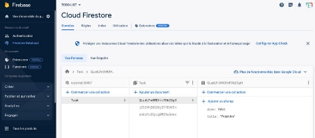
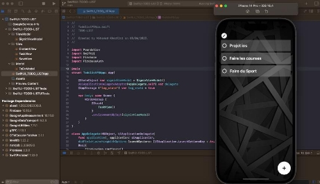

# Swift - TODO List  app

L’objectif est de développer une application iOS pour gérer une liste de tâches.

Les utilisateurs doivent pouvoir ajouter des tâches, les marquer comme terminées et les supprimer.

Les tâches doivent être sauvegardées afin qu’elles soient persistantes et récupérées lors du lancement de l’application. 

  

lien Github : https://github.com/khechinimed/Swift-IOS-TODO-APP

## Lancement du projet:

Une fois télécharger faut l'importer sur xCode et faire un Build et Run du projet pour avoir le rendu sur l'émulateur de xCode

### Demo

Une fois le projet lancer on tombe sur cette interface, avec les tâches qui sont récupérer de la collection "Task" depuis notre BDD sur Firebase

Pour pouvoir tester l'ajout d'une tâche faut appuyer sur l'icone Plus et on aura un champs de texte qui s'affiche pour ajouter le titre de la tache

  

Pour marquer une tâche comme terminé il faut juste appuyer sur le cercle blanc et il se met en vert avec l'îcone "completed" et le champs done dans la base de données se met en True (comme sur la capture en dessous) en temps réel

Et enfin pour supprimer une tâche on clique sur l'icône "edit"  pour éditer la liste et on a l'icone de suppression qui s'affiche devant chaque élément pour pouvoir supprimer les tâches qui ont été réalisé ou abandonné

  

### Développement du projet:

Mon code est écrit en utilisant le framework SwiftUI qui suit le design pattern MVVM (Model View View Model) 

Le Model TodoModel : 

Mon ViewModel est responsable pour l'affichage des méthodes et les fonctions pour maintenir l’état de la vue, manipuler le modèle à la suite des actions sur la vue et déclencher les événements dans la vue elle-même.

` `

UpdateTask: Met à jour une tâche dans la base de données Firestore en fonction de son état de réalisation. Utilise setData pour mettre à jour la valeur "done" du document correspondant. Ensuite, utilise withAnimation pour actualiser la liste des tâches avec FetchData().

DeletTask: Supprime une tâche de la base de données Firestore en utilisant l'ID du document correspondant. Si la suppression réussit, supprime également la tâche de la liste todoList.

SaveTask: Enregistre une nouvelle tâche dans la base de données Firestore en utilisant addDocument avec un dictionnaire contenant le titre et l'état de la tâche. Après l'enregistrement, appelle FetchData() pour actualiser la liste des tâches.

FetchData: Récupère les données des tâches à partir de la base de données Firestore en interrogeant la collection "Task". Crée des objets ToDoModel à partir des données récupérées et les stocke dans la liste todoList. Gère les erreurs en affichant un message dans la console.

### Les Vues

J'ai créer trois vues :

chaque une représente des composants de l’interface utilisateur. Chaque vue affiche les données reçues du contrôleur comme résultat. 

ContentView : Ce fichier je l'ai créer pour pouvoir tester l'authentification Apple au lieu de Google cette fois-ci.

SaveView : Ce fichier contient la vue modale **SaveView** qui est affichée lorsque l'utilisateur souhaite ajouter une nouvelle tâche. Cette vue permet à l'utilisateur de saisir le titre de la tâche et de l'enregistrer.

TaskView : Ce fichier contient la vue principale **TaskView** qui est une structure conforme au protocole **View**. Elle représente la vue principale de l'application où les tâches sont affichées

## Conclusion!

En conclusion, dans ce projet de gestion de tâches, j'ai utilisé SwiftUI pour créer une interface utilisateur réactive et fluide. J'ai choisi SwiftUI en raison de sa facilité d'utilisation, de sa flexibilité et de son intégration étroite avec les fonctionnalités iOS.

J'ai utilisé Firebase Firestore pour stocker et récupérer les données des tâches, pour une base de données en temps réel et d'une synchronisation automatique.

Le code développé comprend des fonctionnalités telles que la mise à jour de l'état d'une tâche, la suppression d'une tâche, l'ajout d'une nouvelle tâche et la récupération des données des tâches depuis la base de données Firestore. 

En résumé, ce projet démontre l'utilisation de SwiftUI et Firebase Firestore pour créer une application de gestion de tâches simple mais fonctionnelle.

Les technologies choisies offrent une expérience utilisateur agréable et une intégration transparente avec les services cloud, ouvrant ainsi la voie à des fonctionnalités avancées et à des améliorations futures.
